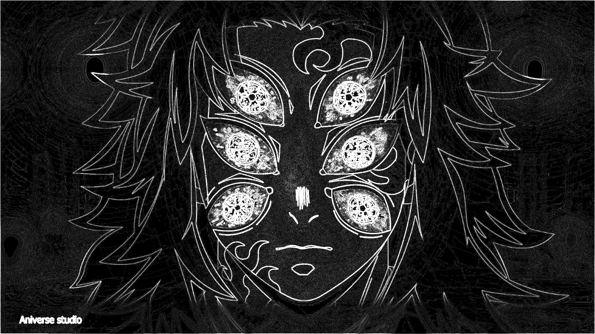

# CUDA Image Convolution Optimization

A CUDA-based image convolution project that implements and compares multiple GPU optimization strategies for RGB image processing.

The project starts with a straightforward global-memory CUDA implementation and progressively introduces **constant memory, shared-memory tiling, and an L2-cache-oriented tiling strategy**. Each implementation performs the same mathematical convolution, allowing their performance and memory behavior to be compared fairly.

The project also includes CPU/GPU correctness validation, CUDA event-based benchmarking, and GPU profiling with NVIDIA Nsight Compute.

---

## Overview

Image convolution is a fundamental operation used in computer vision and image processing.

For an RGB image, each output pixel is calculated by applying a convolution filter independently across the three color channels.

The project keeps the image dimensions unchanged by using zero-padding at the image boundaries.

---

# What This Project Demonstrates

The main goal is to study how different CUDA memory-access strategies affect GPU performance.

The project contains four implementations:

| Implementation | Main Technique |
|---|---|
| Naive | Global memory |
| Constant Memory | CUDA constant memory for filter coefficients |
| Shared Memory Tiled | Shared-memory input tile with halo |
| L2-Oriented Tiled | Shared-memory interior + global-memory halo accesses designed to reuse data through L2 |

All implementations perform the same convolution and produce equivalent output.

This makes it possible to isolate the impact of CUDA optimization techniques without changing the underlying computation.

---

## Example 

Input:


Output:




# Architecture

The overall processing pipeline is:

```text
                 Input Image
                      │
                      ▼
              Load JPEG / PNG
                      │
                      ▼
                 HWC Layout
                      │
                      ▼
                 HWC → CHW
                      │
                      ▼
              Host → Device
                      │
          ┌───────────┴───────────┐
          │                       │
          ▼                       ▼
     CUDA Kernel             CPU Reference
          │                       │
          ▼                       │
     GPU Output                   │
          │                       │
          └───────────┬───────────┘
                      ▼
              Correctness Check
                      │
                      ▼
              Performance Analysis
                      │
          ┌───────────┴───────────┐
          │                       │
          ▼                       ▼
    CUDA Events             Nsight Compute
    Benchmarking               Profiling
```

---

# Input

The program accepts a standard image file such as:

- JPEG
- PNG

The input image is loaded as an RGB image.

For example:

```text
images/
└── input.jpg
```

An image with dimensions:

```text
1920 × 1080 × 3
```

contains:

```text
1920 × 1080
```

pixels and three color channels:

```text
R
G
B
```

---

# Image Representation

The original image is loaded by `stb_image` in HWC format:

```text
Height × Width × Channels
```

For example:

```text
H × W × 3
```

The project converts this into planar CHW format before copying the data to the GPU:

```text
[R plane][G plane][B plane]
```

For a 1920 × 1080 image:

```text
R: 1920 × 1080
G: 1920 × 1080
B: 1920 × 1080
```

The total number of floating-point values is:

```text
1920 × 1080 × 3 = 6,220,800 floats
```

The CUDA kernels therefore access the input using channel planes.

For a pixel at `(row, col)`:

```cpp
int pixel = row * width + col;

R = input[pixel];
G = input[pixel + width * height];
B = input[pixel + 2 * width * height];
```

This layout is used consistently by all CUDA implementations.

---

# Output

The current convolution produces **one output channel** from the three RGB input channels.

Conceptually:

```text
RGB Input
   │
   ▼
3-channel convolution filter
   │
   ▼
1-channel output
```

The output therefore has:

```text
height × width × 1
```

values.

The raw convolution result is stored as floating-point values.

Because convolution filters such as Sobel, Laplacian, and sharpening filters can produce negative values, the raw floating-point output is not directly written as an 8-bit image.

For visualization, the output is min-max normalized:

\[
x_{normalized}
=
\frac{x-x_{min}}{x_{max}-x_{min}}
\]

and then converted to:

```text
0 → 255
```

This normalization is only for visualization. It is **not part of the convolution computation**.

---

# Convolution Filters

The project supports filters such as:

- Identity
- Sharpen
- Sobel X
- Sobel Y
- Laplacian
- Gaussian blur
- Box blur
- Larger filters for performance experiments

For example, a 3×3 sharpening filter can be represented as:

```text
 0  -1   0
-1   5  -1
 0  -1   0
```

For a 3×3 filter:

```text
FILTER_SIZE = 3
RADIUS      = 1
```

The filter coefficients are stored in CUDA constant memory for kernels that use constant-memory access.

---

# CUDA Implementations

## 1. Naive Global-Memory Kernel

The first implementation is intentionally straightforward.

Each CUDA thread calculates one output pixel.

```text
Thread
   │
   ├── Read neighboring pixels from global memory
   ├── Apply convolution filter
   └── Write one output pixel
```

For a 3×3 filter and RGB input, each output requires:

```text
3 × 3 × 3 = 27
```

input/filter combinations.

The kernel is primarily used as the baseline for comparison.

### Main characteristics

- Simple implementation
- Global-memory input accesses
- One thread computes one output pixel
- No explicit shared-memory tiling
- Easy to understand and verify

---

# 2. Constant-Memory Kernel

The second implementation stores the convolution filter in CUDA constant memory.

```cpp
__constant__ float filter_d[...];
```

The filter is small and read repeatedly by many threads, making it a suitable candidate for constant memory.

Instead of loading filter coefficients from ordinary global memory, threads access the same coefficients through the constant-memory mechanism.

### Main characteristics

- Input image remains in global memory
- Filter coefficients stored in constant memory
- Reduces repeated global-memory accesses to filter coefficients
- Useful for studying CUDA memory hierarchy

The filter is copied to the GPU once:

```cpp
cudaMemcpyToSymbol(...)
```

and this transfer is excluded from kernel execution timing.

---

# 3. Shared-Memory Tiled Kernel

The third implementation introduces shared-memory tiling.

Instead of every thread repeatedly loading neighboring pixels from global memory, a block first cooperatively loads an input tile into shared memory.

For example, with a 3×3 filter:

```text
Radius = 1
```

A 14×14 output tile requires a:

```text
16×16 input tile
```

because of the one-pixel halo around the output region.

```text
              Input Tile
        ┌──────────────────┐
        │     Halo         │
        │  ┌────────────┐  │
        │  │            │  │
        │  │   Output   │  │
        │  │    Tile    │  │
        │  │            │  │
        │  └────────────┘  │
        │     Halo         │
        └──────────────────┘
```

The data is loaded cooperatively:

```text
Global Memory
      │
      ▼
Shared Memory
      │
      ▼
Multiple convolution operations
```

After loading the tile:

```cpp
__syncthreads();
```

ensures that all threads can safely access the shared data.

### Main characteristics

- Cooperative global-memory loading
- Shared-memory reuse
- Explicit halo handling
- Fewer redundant global-memory accesses
- Synchronization using `__syncthreads()`

---

# 4. L2-Oriented Tiled Kernel

The fourth implementation explores a different tiling strategy.

Instead of loading the halo region into shared memory, the block stores its output-sized region in shared memory.

For a 32×32 output tile:

```text
32 × 32 threads
```

load:

```text
32 × 32 × 3
```

RGB values into shared memory.

For convolution accesses that fall outside the shared-memory tile, the kernel accesses global memory directly.

The idea is to allow neighboring blocks to request overlapping halo data while relying on the GPU's hardware-managed L2 cache to potentially reuse those accesses.

```text
                 Global Memory
                      │
          ┌───────────┴───────────┐
          │                       │
          ▼                       ▼
    Shared-memory tile      Halo accesses
          │                       │
          │                  L2 Cache
          │                       │
          └───────────┬───────────┘
                      ▼
                 Convolution
```

Important:

> The kernel does not explicitly control or "load data into L2 cache." L2 caching is hardware-managed. The implementation is described as **L2-oriented** because its access pattern is designed to potentially benefit from cache reuse.

### Main characteristics

- Output-sized shared-memory tile
- Interior accesses served from shared memory
- Halo accesses performed through global memory
- Potential reuse through the hardware-managed L2 cache
- 32×32 thread block for the current implementation

---

# CUDA Thread Mapping

The kernels use a 2D CUDA grid and 2D thread blocks.

For example:

```cpp
dim3 block(32, 32);

dim3 grid(
    (width  + block.x - 1) / block.x,
    (height + block.y - 1) / block.y
);
```

Each thread corresponds to one image coordinate:

```cpp
int row = blockIdx.y * blockDim.y + threadIdx.y;
int col = blockIdx.x * blockDim.x + threadIdx.x;
```

The output pixel is then:

```cpp
output[row * width + col]
```

Boundary checks prevent threads outside the image dimensions from accessing invalid memory.

---

# Boundary Handling

The convolution uses zero-padding at image boundaries.

For example, if a filter accesses a pixel outside the image:

```text
row < 0
row >= height
col < 0
col >= width
```

that value is treated as:

```text
0.0
```

This allows the output image to maintain the same dimensions as the input.

Therefore:

```text
Input:   H × W × 3
Output:  H × W × 1
```

---

# Benchmarking

The program can execute individual implementations or compare all implementations.

Example:

```bash
convolution.exe --kernel naive
```

```bash
convolution.exe --kernel constant
```

```bash
convolution.exe --kernel tiled
```

```bash
convolution.exe --kernel l2
```

To run all implementations:

```bash
convolution.exe --kernel all
```

Example output:

```text
========== CUDA Convolution Benchmark ==========

Kernel                 Time (ms)
---------------------------------
Naive                  XX.XX
Constant Memory        XX.XX
Shared Memory Tiled    XX.XX
L2-Oriented Tiled      XX.XX

=================================================
```

Actual performance depends on:

- GPU architecture
- GPU clock frequency
- image resolution
- filter size
- filter type
- memory behavior
- driver/runtime
- thermal conditions
- system load

Therefore, benchmark numbers should not be interpreted as universal CUDA performance values.

---

# Nsight Compute Profiling

The project can also be profiled using NVIDIA Nsight Compute.

For example:

```bash
ncu --set full convolution.exe --kernel naive
```

or:

```bash
ncu --set full convolution.exe --kernel tiled
```

For a specific kernel, profiling should normally be performed externally rather than having the CUDA program launch Nsight Compute itself.

---

# Project Structure

```text
Project1/
│
├── Makefile
├── main.cpp
│
├── include/
│   ├── convolution.h
│   ├── cuda_utils.cuh
│   ├── filter.cuh
│   └── imageloader.h
│
├── src/
│   ├── naive.cu
│   ├── constant-memory.cu
│   ├── tiled.cu
│   └── l2.cu
│
├── preprocessor/
│   ├── imageloader.cpp
│   └── stb_image.h
│
├── images/
│   └── input.jpg
│
├── output/
│   └── output.jpg
│
└── README.md
```

---

# Building

Clone the repository:

```bash
git clone https://github.com/Kaustbh/Convolution-Kernel-Optimization.git
cd Project1
```

Build using Make:

```bash
make
```

This produces:

```text
convolution.exe
```

The Makefile invokes `nvcc` to compile the host C++ code and CUDA `.cu` files and then links them into the final executable.

---

# Running

Place an input image in the `images/` directory.

For example:

```text
images/
└── demon-slayer.jpeg
```

Then run a specific implementation.

### Naive

```bash
convolution.exe --kernel naive
```

### Constant memory

```bash
convolution.exe --kernel constant
```

### Shared-memory tiled

```bash
convolution.exe --kernel tiled
```

### L2-oriented tiled

```bash
convolution.exe --kernel l2
```

### Run all implementations

```bash
convolution.exe --kernel all
```

---

# Performance Results

Performance should be reported using measurements from the target GPU.

Example format:

| Kernel | Execution Time |
|---|---:|
| Naive Global Memory | XX ms |
| Constant Memory | XX ms |
| Shared Memory Tiled | XX ms |
| L2-Oriented Tiled | XX ms |

For reproducible benchmarking, use the same:

- input image
- image dimensions
- filter
- filter size
- GPU
- CUDA version
- benchmark configuration

When possible, run multiple iterations and report an average or median rather than relying on a single kernel execution.

---

# Why Different Optimizations Behave Differently

A major purpose of this project is demonstrating that an optimization that looks theoretically better does not necessarily produce a faster kernel.

For example:

### Constant memory

Can reduce the cost of repeatedly accessing filter coefficients.

However, a very small filter such as a 3×3 filter may not provide a dramatic performance improvement because the filter itself contains only a small number of values.

---

### Shared memory

Can significantly reduce redundant global-memory accesses by allowing neighboring threads to reuse pixels.

However, shared-memory tiling introduces:

- cooperative loading
- synchronization
- additional indexing
- shared-memory usage
- halo handling

Therefore, the overhead can sometimes outweigh the benefit for certain image sizes or filter sizes.

---

### L2-oriented tiling

Attempts to reduce shared-memory requirements for halo data and exploit cache reuse between neighboring blocks.

However, L2 is hardware-managed, so performance depends heavily on:

- GPU architecture
- access pattern
- block scheduling
- cache capacity
- filter size
- image dimensions

This is why profiling is essential.

---

# Future Improvements

Possible extensions include:

- Multiple output feature maps
- Multi-channel convolution
- Larger convolution filters
- Separable Gaussian convolution
- Half-precision (`FP16`) computation
- Tensor Core implementations
- CUDA streams
- Asynchronous memory copies
- Pinned host memory
- Batched image processing
- More systematic benchmark automation
- CSV benchmark output
- Automated Nsight profiling
- Comparison against cuDNN
- Comparison against CPU SIMD implementations

These are intentionally outside the core scope of the current project.

---

# Project Goal

The primary goal of this project is not to implement the most sophisticated image-processing pipeline.

The goal is to understand how CUDA performance changes when the same computation is implemented using different GPU memory strategies.

The progression is:

```text
Naive Global Memory
        │
        ▼
Constant Memory
        │
        ▼
Shared-Memory Tiling
        │
        ▼
L2-Oriented Tiling
        │
        ▼
Benchmark + Profile
        │
        ▼
Understand the Bottleneck
```

---

# Author

**Kaustubh Desale**

CUDA / GPU Programming • Machine Learning • AI Systems

